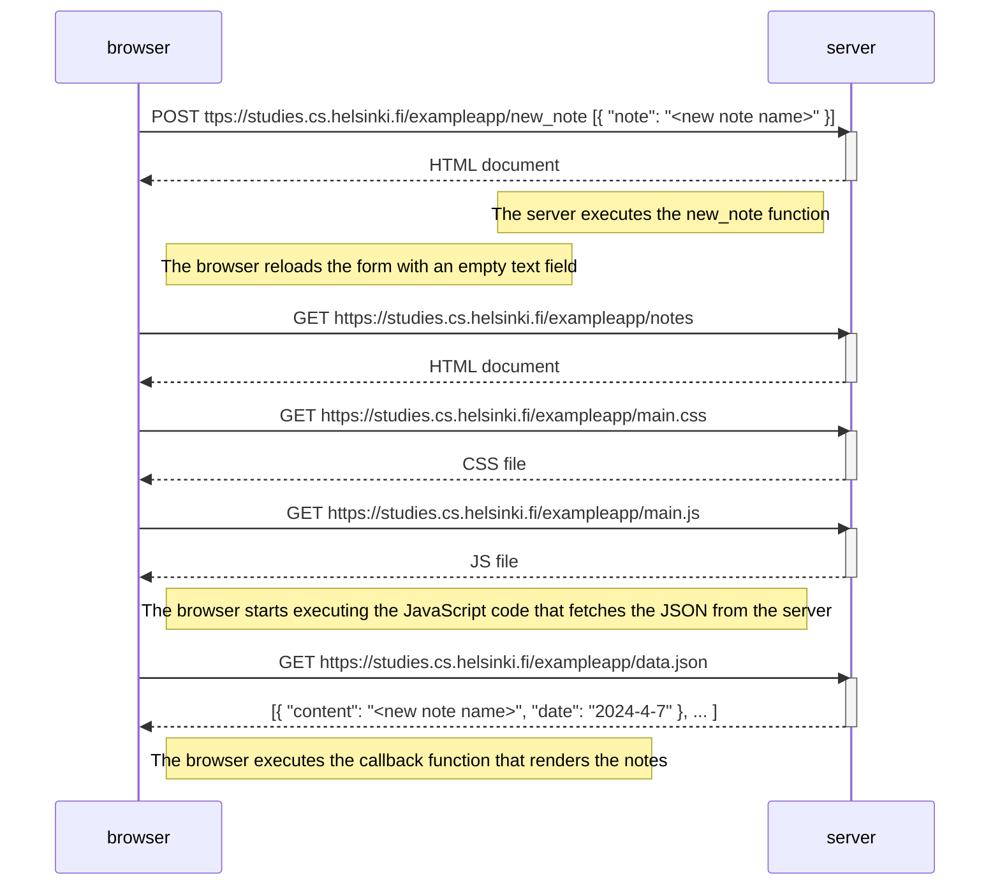
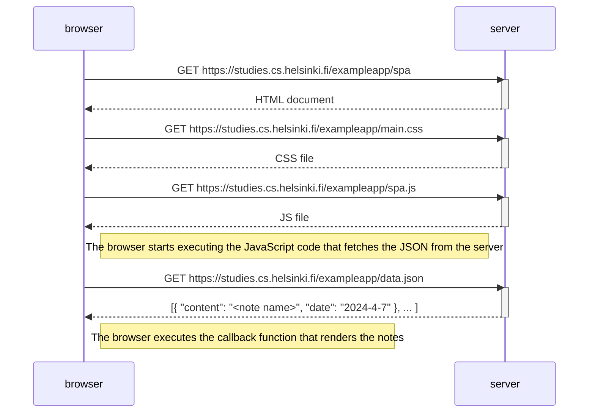
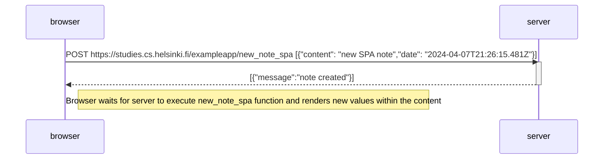

Example 0.4: New note diagram

```mermaid
sequenceDiagram
    participant browser
    participant server

    browser->>server: POST ttps://studies.cs.helsinki.fi/exampleapp/new_note [{ "note": "<new note name>" }]
    activate server
    server-->>browser: HTML document
    deactivate server

    Note left of server: The server executes the new_note function
    Note right of browser: The browser reloads the form with an empty text field

    browser->>server: GET https://studies.cs.helsinki.fi/exampleapp/notes
    activate server
    server-->>browser: HTML document
    deactivate server

    browser->>server: GET https://studies.cs.helsinki.fi/exampleapp/main.css
    activate server
    server-->>browser: CSS file
    deactivate server

    browser->>server: GET https://studies.cs.helsinki.fi/exampleapp/main.js
    activate server
    server-->>browser: JS file
    deactivate server

    Note right of browser: The browser starts executing the JavaScript code that fetches the JSON from the server

    browser->>server: GET https://studies.cs.helsinki.fi/exampleapp/data.json
    activate server
    server-->>browser: [{ "content": "<new note name>", "date": "2024-4-7" }, ... ]
    deactivate server

    Note right of browser: The browser executes the callback function that renders the notes
```

Example 0.5: Single page app diagram

```mermaid
sequenceDiagram
    participant browser
    participant server

    browser->>server: GET https://studies.cs.helsinki.fi/exampleapp/spa
    activate server
    server-->>browser: HTML document
    deactivate server

    browser->>server: GET https://studies.cs.helsinki.fi/exampleapp/main.css
    activate server
    server-->>browser: CSS file
    deactivate server

    browser->>server: GET https://studies.cs.helsinki.fi/exampleapp/spa.js
    activate server
    server-->>browser: JS file
    deactivate server

    Note right of browser: The browser starts executing the JavaScript code that fetches the JSON from the server

    browser->>server: GET https://studies.cs.helsinki.fi/exampleapp/data.json
    activate server
    server-->>browser: [{ "content": "<note name>", "date": "2024-4-7" }, ... ]
    deactivate server

    Note right of browser: The browser executes the callback function that renders the notes
```

Example 0.6: New note in Single page app diagram

```mermaid
sequenceDiagram
    participant browser
    participant server

    browser->>server: POST https://studies.cs.helsinki.fi/exampleapp/new_note_spa [{"content": "new SPA note","date": "2024-04-07T21:26:15.481Z"}]
    activate server
    server-->>browser: [{"message":"note created"}]
    deactivate server

    Note right of browser: Browser waits for server to execute new_note_spa function and renders new values within the content
```
